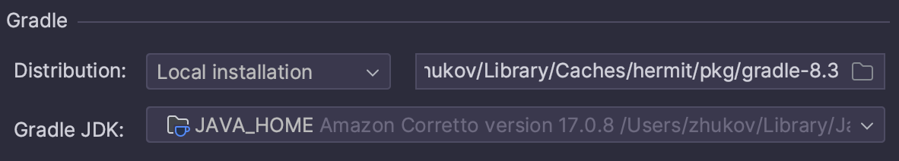

Sample project for reproducing an issue where Android Studio is not using local Gradle distribution,
and instead spins out a new Gradle daemon using older version of Gradle.

Project setup:
- A simple blank Android app created via AS wizard
- Gradle wrapper is disabled
- [Hermit](https://cashapp.github.io/hermit/) is used to manage local Gradle distribution, checked in in `/bin` folder

Issue:
When opening the project, AS spins out a new Gradle 8.0 daemon instead of using local Gradle 8.3 distribution:

```
$ ps aux | grep -i gradle

zhukov           33296 576.5  2.5 414159328 1664912   ??  Rs   12:23PM   0:57.23 /Users/zhukov/Library/Java/JavaVirtualMachines/corretto-17.0.8.8.1.jdk/Contents/Home/bin/java --add-opens=java.base/java.util=ALL-UNNAMED --add-opens=java.base/java.lang=ALL-UNNAMED --add-opens=java.base/java.lang.invoke=ALL-UNNAMED --add-opens=java.prefs/java.util.prefs=ALL-UNNAMED --add-opens=java.base/java.nio.charset=ALL-UNNAMED --add-opens=java.base/java.net=ALL-UNNAMED --add-opens=java.base/java.util.concurrent.atomic=ALL-UNNAMED -Xmx2048m -Dfile.encoding=UTF-8 -Duser.country=US -Duser.language=en -Duser.variant -cp /Users/zhukov/Library/Caches/hermit/pkg/gradle-8.3/lib/gradle-launcher-8.3.jar -javaagent:/Users/zhukov/Library/Caches/hermit/pkg/gradle-8.3/lib/agents/gradle-instrumentation-agent-8.3.jar org.gradle.launcher.daemon.bootstrap.GradleDaemon 8.3
zhukov           33244   0.7  0.8 413852256 553376   ??  Ss   12:22PM   0:14.15 /Users/zhukov/Library/Java/JavaVirtualMachines/corretto-17.0.8.8.1.jdk/Contents/Home/bin/java --add-opens=java.base/java.util=ALL-UNNAMED --add-opens=java.base/java.lang=ALL-UNNAMED --add-opens=java.base/java.lang.invoke=ALL-UNNAMED --add-opens=java.prefs/java.util.prefs=ALL-UNNAMED --add-opens=java.base/java.nio.charset=ALL-UNNAMED --add-opens=java.base/java.net=ALL-UNNAMED --add-opens=java.base/java.util.concurrent.atomic=ALL-UNNAMED -Xmx2048m -Dfile.encoding=UTF-8 -Duser.country=US -Duser.language=en -Duser.variant -cp /Users/zhukov/.gradle/wrapper/dists/gradle-8.0-bin/ca5e32bp14vu59qr306oxotwh/gradle-8.0/lib/gradle-launcher-8.0.jar org.gradle.launcher.daemon.bootstrap.GradleDaemon 8.0
zhukov           33329   0.0  0.0 408495824   1072 s002  R+   12:23PM   0:00.00 grep --color=auto --exclude-dir=.bzr --exclude-dir=CVS --exclude-dir=.git --exclude-dir=.hg --exclude-dir=.svn --exclude-dir=.idea --exclude-dir=.tox -i gradle
zhukov           33295   0.0  1.5 413912000 974800   ??  Ss   12:23PM   0:26.42 /Users/zhukov/Library/Java/JavaVirtualMachines/corretto-17.0.8.8.1.jdk/Contents/Home/bin/java --add-opens=java.base/java.util=ALL-UNNAMED --add-opens=java.base/java.lang=ALL-UNNAMED --add-opens=java.base/java.lang.invoke=ALL-UNNAMED --add-opens=java.prefs/java.util.prefs=ALL-UNNAMED --add-opens=java.base/java.nio.charset=ALL-UNNAMED --add-opens=java.base/java.net=ALL-UNNAMED --add-opens=java.base/java.util.concurrent.atomic=ALL-UNNAMED -Xmx2048m -Dfile.encoding=UTF-8 -Duser.country=US -Duser.language=en -Duser.variant -cp /Users/zhukov/Library/Caches/hermit/pkg/gradle-8.3/lib/gradle-launcher-8.3.jar -javaagent:/Users/zhukov/Library/Caches/hermit/pkg/gradle-8.3/lib/agents/gradle-instrumentation-agent-8.3.jar org.gradle.launcher.daemon.bootstrap.GradleDaemon 8.3
```

**In fact, as you can see from output, it also spins out an extra Gradle 8.3 daemon, not clear if this is related to the issue.**

Issue happens reliably on Hedgehog and Giraffe, haven't tested other versions.

Steps to reproduce:

- Make sure no Gradle daemons are running locally: `ps aux | grep -i gradle`
- Install [Hermit IJ plugin](https://plugins.jetbrains.com/plugin/16882-hermit), this ensures that the project uses local Gradle distribution, can confirm that Android Studio picks it up appropriately in `Change Gradle JDK Location` settings:


- Open the project in Android Studio
- Let it start syncing and build the app, see that it spins two Gradle daemons, one for 8.0 and one for 8.3: `ps aux | grep -i gradle`.

